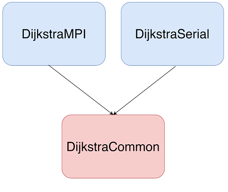

# Dijkstra's algorithm using MPI

This repository contains Dijkstra's Shortest Path algorithm implemented using C++ and MPI (Message Passing Interface).


### Algorithm
The algorithm itself is based on implementation described in *Introduction to Parallel Computing, Second Edition* by Ananth Grama, Anshul Gupta, George Karypis and Vipin Kumar. The goal is to **find shortest paths from selected vertex to every other vertex in the graph**. The algorithm works for both directed and undirected graphs with non-negative weights. Our implementation consists of three major steps:
 1. initialization - loading graph data from file and distributing it, preparing MPI infrastructure
 2. the algorithm itself
 3. saving results to file, dealocation

In out implementation, graph is stored using **adjacency matrix** representation. The data is distributed evenly between all available processes. If there are any columns left, they are assigned to first *k* processes. Example:


If there is more processes than matrix columns, unnecessary processes do not take part in rest of the algorithm execution (separate MPI communicator it created). During the second step, we repeat following actions until all vertices had been processed:

 1. Each process operates on vertices assigned to it that have not been processed yet and chooses the one with the smallest cost (based on values in an array). 


 2. Vertex with globally smallest cost is chosen (using reduction operation) and marked as processed. Array of costs is updated.


When algorithm execution is done, execution time is printed and results are saved to file. 


### Implementation details
This project is divided into three main components:
 * `DijkstraMPI` - algorithm implementation using MPI 
 * `DijkstraSerial` - sequential algorithm implementation
 * `DijkstraCommon` - common code used by both implementations



Following features of MPI have been used:
 * collective operations: `MPI_Bcast`, `MPI_Scatter`, `MPI_Scatterv`, `MPI_Allreduce`, `MPI_Gatherv`
 * communicators


### Contributors
 * [Aleksandra Poręba](https://github.com/karmazynow-a)
 * [Arkadiusz Kasprzak](https://github.com/arokasprz100)


### Repository content
 * `Dijkstra` - main directory of the project. Contains sequential and MPI implementations of Dijkstra's algorithm as well as common library used by both implementations.
 * `data` - contains sample input data generation script (Python) as well as sample input file
 * `test` - contains sequential implementation of Dijkstra's algorithm written in Python. It was used for testing.
 * `example_results` - contains files with example results generated using MPI implementation of Dijkstra's algorithm
 * `report` and `seminars` - contain documentation and presentation (in polish, since it was a part of university project)
 * `build_uni` - contains setup used for building this project on university infrastructure. You should probably ignore it.
 * `images` - contains `.png` images used in this Readme
 * `Doxyfile.in` - Doxygen setup
 * `CMakeLists.txt` - primary CMake file used for building the project and generating documentation


### Building and generating documentation
For building the software you can use prepared `CMakeLists.txt`. The MPI library is necessary. Doxygen is needed for documentation.

Make options:
```
make clean-all                              cleans the directory from build files
make install-all                            move executables to root of binary dir
make doc                                    create Doxygen documentation
make runMPI                                 runs MPI algorithm with default parameter 
                                                VERTEX=0 FILE="../data/graph.dat" and N=1
make runMPI VERTEX=V FILE=F N=N HOSTS=H     runs MPI algorithm with parameters VERTEX=V FILE=F N=N HOSTS=H
make runSerial                              runs serial algorithm with default parameter 
                                                VERTEX=0 and FILE="../data/graph.dat"
make runSerial VERTEX=V FILE=F              runs serial algorithm with parameter VERTEX=V FILE=F
```
If you want to generate docs make sure you run cmake with proper option:
```
cmake -DBUILD_DOC=ON
```


### Generating sample data
Simple Python script has been created to generate adjacency matrix representation of graph with given number of nodes
and vertices. Usage: 
```
generateGraphs.py [-h] [-e E] [-v V] [-f FILE]

optional arguments:
-h, --help                      show this help message and exit
-e E, --edges E                 number of edges
-v V, --vertices V              number of vertices
-f FILE, --file FILE            name of output file
```


### Using sequential prototype
For the sake of testing, sequential implementation of Dijkstra's algorithm has been created using Python. Usage:
```
test.py [-h] [-o FILE] FILE VERTEX

positional arguments:
FILE                        input file with adjacency matrix
VERTEX                      vertex to start algorithm

optional arguments:
-h, --help                  show this help message and exit
-o FILE, --output FILE      output file with path
```